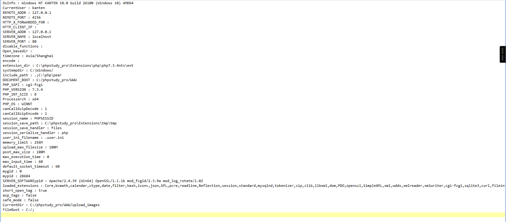
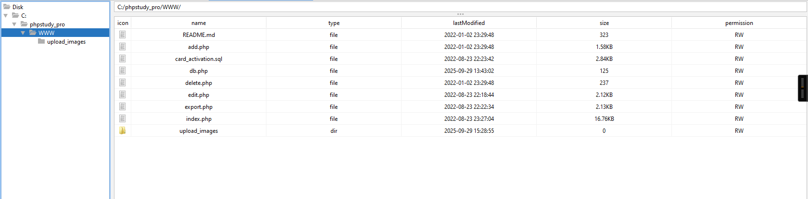
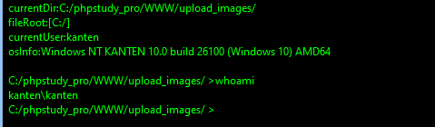

# Security Advisory: Unauthenticated Arbitrary File Upload leads to Remote Code Execution

- Vulnerability Type: Arbitrary File Upload → RCE (Critical, Unauthenticated)
- Affected Project: Student-Registration-Crud-Operation
- Components: add.php, edit.php
- Severity: Critical
- CVSS v3.1 Vector (estimated): AV:N/AC:L/PR:N/UI:N/S:U/C:H/I:H/A:H
- Discovery Date: 2025-09-29
- Reporter: px

## Summary

The application allows unauthenticated upload of arbitrary files to a web-accessible directory `upload_images/` without extension/MIME/content validation. If the server executes scripts under that directory, an attacker can upload a PHP payload and obtain remote code execution.

## Affected Versions

- All versions where `add.php` / `edit.php` use `move_uploaded_file()` to save user-provided files under `upload_images/` without validation.

## Technical Details (code evidence)

- <mcfile name="add.php" path="c:\Downloads\Student_Crud_Operation_In_PHP_With_Source_Code\Student-Registration-Crud-Operation\add.php"></mcfile>
```php
// ... existing code ...
$image = $_FILES['image']['name'];
$target = "upload_images/".basename($image);
if (move_uploaded_file($_FILES['image']['tmp_name'], $target)) {
    // No extension/MIME/content checks
}
// ... existing code ...
```

- <mcfile name="edit.php" path="c:\Downloads\Student_Crud_Operation_In_PHP_With_Source_Code\Student-Registration-Crud-Operation\edit.php"></mcfile>
```php
// ... existing code ...
$image = $_FILES['image']['name'];
$target = "upload_images/".basename($image);
if($run_update){
    move_uploaded_file($_FILES['image']['tmp_name'], $target);
}
// ... existing code ...
```

## Proof of Concept (PoC)

- Preconditions:
  - App accessible at `{BASE_URL}/Student-Registration-Crud-Operation/` <mcreference link="https://code-projects.org/student-crud-operation-in-php-with-source-code/" index="0">0</mcreference>
  - DB schema mismatches may cause INSERT failure (“Data not insert”) in `add.php`, but the upload occurs before the INSERT and succeeds.

- Steps:
  1. Open `index.php` → “Add New Student”, upload `webshell.php` (or `poc.php` with `<?php echo "poc-ok"; ?>`). Submit.
  2. Visit `{BASE_URL}/Student-Registration-Crud-Operation/upload_images/webshell.php` (or `poc.php`).
  3. Observe execution/response.

## Proof #1 — Webshell connects successfully
- Description: The uploaded `webshell.php` is reachable at `/upload_images/webshell.php`. The management client connects and shows server environment information (OS, PHP version, document root).
- Image:


## Proof #2 — Webshell connects successfully
- Description: filemanager from webshell
- Image:


## Proof #3 — Command execution (whoami)
- Description: Executing `whoami` via the webshell returns the current user (e.g., `kanten`), proving remote code execution.
- Image:


## Impact

- Full server compromise: arbitrary command execution, file read/write, database operations, lateral movement.

## Severity and Scoring

- Severity: P1 (Critical).
- CVSS v3.1 (estimated): AV:N/AC:L/PR:N/UI:N/S:U/C:H/I:H/A:H.

## Mitigation Priority

- [Mitigation priority (1–5)]: <5> (highest priority, fix immediately)

## Remediation

1. Strict file validation:
   - Allow-list extensions (e.g., .jpg/.png/.gif) and validate MIME plus content (getimagesize/imagetype); reject executable types.
2. Storage hardening:
   - Randomize file names, remove user-provided extensions, store outside the web root or in a directory with script execution disabled.
3. Access control:
   - Require authentication/authorization for uploads; enforce CSRF for state-changing actions.
4. Size and path protections:
   - Enforce max sizes, sanitize names, deny path traversal.
5. Monitoring:
   - Log uploads and alert on suspicious extensions.

## References

- Project homepage: https://code-projects.org/student-crud-operation-in-php-with-source-code/ <mcreference link="https://code-projects.org/student-crud-operation-in-php-with-source-code/" index="0">0</mcreference>
- Source download page: https://download.code-projects.org/details/c4836779-1828-4e2b-95c2-e027096314c6 <mcreference link="https://download.code-projects.org/details/c4836779-1828-4e2b-95c2-e027096314c6" index="1">1</mcreference>